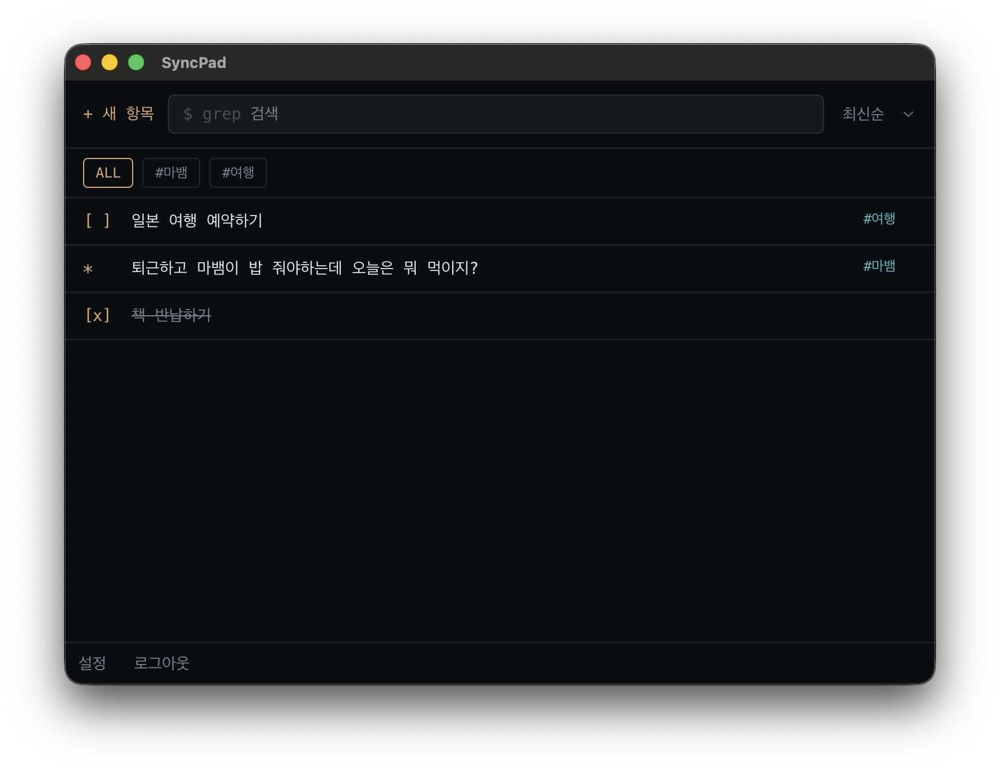
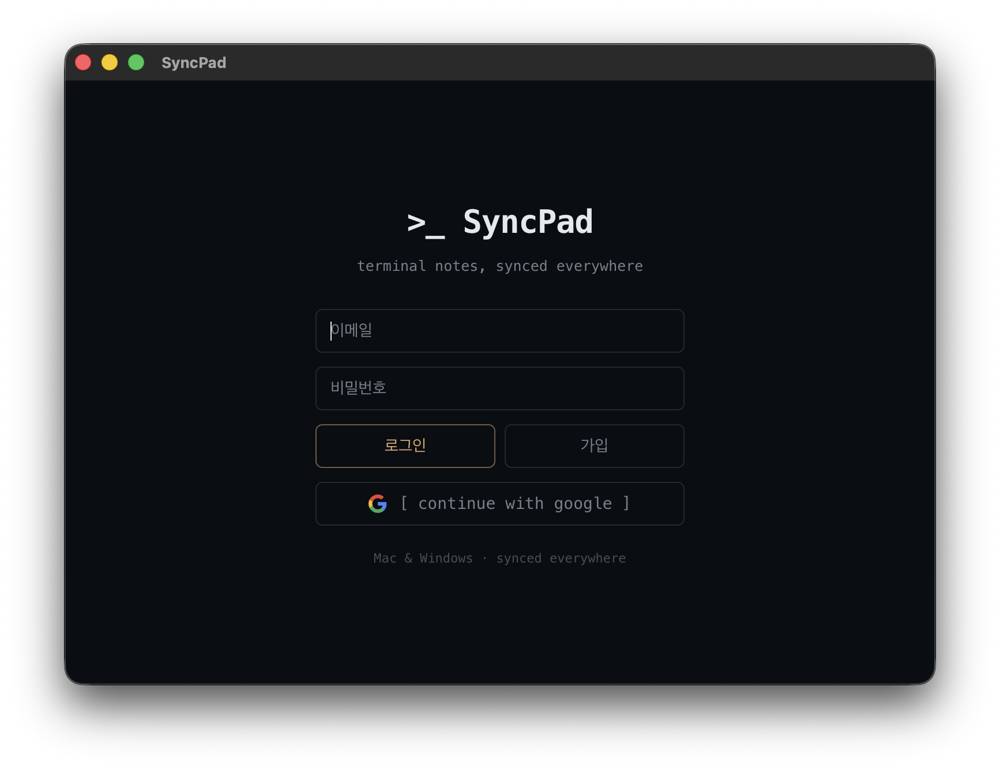
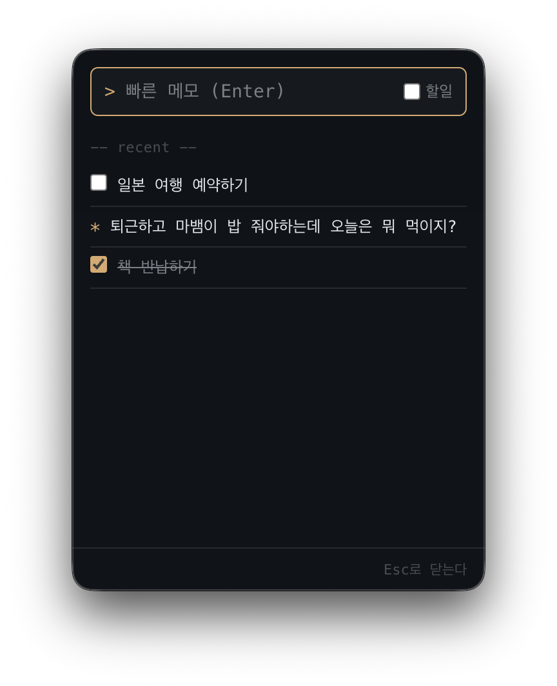
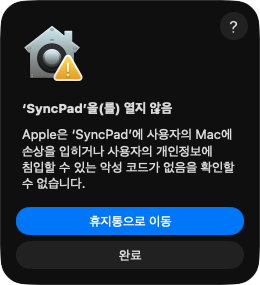
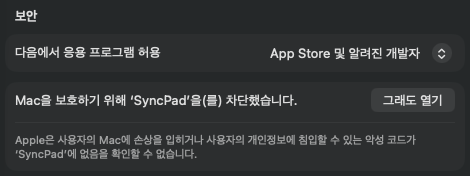

# SyncPad

Mac/Windows 크로스 플랫폼 메모·ToDo 앱입니다. 터미널 감성 UI에 계정 기반 실시간 동기화를 더했습니다. (Electron + React + Supabase)

|                로그인                 |             트레이 팝업              |
| :-----------------------------------: | :----------------------------------: |
|  |  |

**목차** — [주요 기능](#주요-기능) · [설치](#설치) · [사용법](#사용법) · [데이터 저장 위치](#데이터-저장-위치) · [문제 해결](#문제-해결) · [기술 스택](#기술-스택)

## 주요 기능

- **메모/할일 통합 아이템** — 체크박스 옵션, 클릭하면 그 줄에서 바로 수정
- **실시간 동기화** — 로그인한 계정의 모든 기기에 Supabase Realtime으로 반영
- **로그인** — 이메일/비밀번호, Google
- **검색·정렬**, 상단 탭 카테고리 필터(ALL 포함)
- **퀵 액세스** — macOS 메뉴바 / Windows 트레이 팝업에서 바로 추가

# 다운로드해서 쓰기

## 지원 환경

| OS      | 버전                    | 받을 파일                                                                             |
| ------- | ----------------------- | ------------------------------------------------------------------------------------- |
| macOS   | 12 Monterey 이상        | Apple Silicon(M1 이후): `syncpad-<버전>-arm64.dmg` Intel: `syncpad-<버전>-x64.dmg` |
| Windows | Windows 10, 11 (64비트) | `syncpad-<버전>-setup.exe`                                                            |

내 Mac이 어느 쪽인지는 화면 왼쪽 위 Apple 메뉴 → 이 Mac에 관하여 → "칩"(Apple M…이면 Apple Silicon) 또는 "프로세서"(Intel)에서 확인할 수 있습니다.

## 설치

위 **다운로드** 버튼 → 최신 릴리스 페이지 아래쪽 Assets에서 내 OS에 맞는 파일을 받습니다.

SyncPad는 유료 코드 서명을 하지 않은 무료 앱이라 처음 실행할 때 OS가 경고를 띄웁니다. 아래 순서대로 한 번만 풀어 주면 그다음부터는 평소처럼 열립니다.

### macOS

1. 받은 `.dmg`를 열고 SyncPad 아이콘을 Applications 폴더로 끌어다 놓습니다.
2. SyncPad를 처음 열면 아래 경고가 뜹니다. Apple 유료 인증서로 서명하지 않은 앱이라 나오는 메시지입니다. **완료**를 누릅니다(휴지통으로 이동 X).

   

3. 화면 왼쪽 위 Apple 메뉴 → **시스템 설정** → **개인정보 보호 및 보안**을 열고 맨 아래 "보안"까지 내립니다. "SyncPad을(를) 차단했습니다" 옆의 **그래도 열기**를 누릅니다.

   

4. 한 번 더 뜨는 확인 창에서 **그래도 열기**를 누르고 Mac 암호(또는 Touch ID)를 입력합니다. 이후로는 경고 없이 열립니다.

> "그래도 열기" 버튼은 2번 경고를 본 뒤 약 1시간 동안만 보입니다. 없으면 SyncPad를 다시 한 번 열어 2번부터 반복합니다.

### Windows

1. 받은 `syncpad-<버전>-setup.exe`를 실행합니다.
2. 파란 **"Windows의 PC 보호"** 창이 뜨면 **추가 정보**를 누르고, 나타난 **실행** 버튼을 누릅니다.
3. 설치가 끝나면 바탕화면과 시작 메뉴에 SyncPad가 생깁니다.

## 사용법

1. **로그인** — 처음 열면 로그인 화면이 나옵니다.
   - 이메일/비밀번호: 처음이면 이메일과 비밀번호(6자 이상)를 입력하고 **가입**을, 이후에는 **로그인**을 누릅니다.
   - Google: **continue with google**을 누르면 브라우저가 열립니다. Google 로그인 후 브라우저가 "SyncPad 열기"를 물으면 허용합니다.
2. **쓰기** — **+ 새 항목**으로 줄을 만들고 내용을 적습니다. 줄을 클릭하면 그 자리에서 고칠 수 있습니다. 줄 앞 마커를 누를 때마다 메모(`-`) → 할일(`[ ]`) → 완료(`[x]`)로 바뀝니다.
3. **다른 기기에서** — 다른 Mac/PC에도 SyncPad를 설치하고 **같은 계정**으로 로그인하면 됩니다. 한쪽에서 고친 내용이 다른 쪽에 바로 나타납니다. 따로 동기화 버튼은 없습니다.
4. **퀵 액세스** — 창을 닫아도 macOS 메뉴바(Windows는 작업 표시줄 오른쪽 트레이)에 아이콘이 남습니다. 누르면 작은 팝업에서 바로 추가할 수 있습니다. 완전히 끄려면 트레이 아이콘을 우클릭 → **종료**를 누릅니다.

## 데이터 저장 위치

- 메모와 할일은 내 컴퓨터가 아니라 **SyncPad 개발자가 운영하는 클라우드 서버([Supabase](https://supabase.com))** 에 저장됩니다. 그래서 여러 기기에서 같은 내용이 보입니다. 사용자가 서버를 따로 준비할 필요는 없습니다.
- 저장되는 것: 로그인 이메일, 작성한 메모/할일과 카테고리. 다른 사용자는 내 데이터를 읽을 수 없도록 서버에서 계정별로 막혀 있습니다.
- 서버 관리자는 기술적으로 데이터베이스에 접근할 수 있습니다. 비밀번호 등 민감한 정보는 적지 않기를 권합니다.
- 인터넷 연결이 필요합니다. 오프라인에서는 쓰거나 불러올 수 없습니다.
- 계정·데이터 삭제를 원하면 [Issues](https://github.com/HYE77/SyncPad/issues)로 요청해 주세요.

## 문제 해결

- **가입했는데 로그인이 안 됩니다** — 가입한 메일함(스팸함 포함)에 인증 메일이 왔다면 링크를 먼저 누릅니다. 비밀번호는 6자 이상이어야 합니다.
- **Google 로그인 후 앱으로 돌아오지 않습니다** — 브라우저의 "SyncPad 열기" 확인 창을 허용했는지 확인합니다. 막혔다면 앱을 껐다 켜고 다시 시도합니다.
- **다른 기기에 반영이 안 되거나 늦습니다** — 두 기기가 같은 계정으로 로그인했는지, 인터넷이 연결돼 있는지 확인합니다. 연결이 돌아오면 자동으로 다시 불러오고, 그래도 안 되면 앱을 재시작합니다.
- **macOS 시스템 설정에 "그래도 열기"가 없습니다** — SyncPad를 한 번 열어 경고를 띄운 뒤 **완료**를 누르고 다시 확인합니다. 그래도 안 되면 터미널에서 `xattr -cr /Applications/SyncPad.app`을 실행한 뒤 엽니다.
- 그 밖의 문제는 [Issues](https://github.com/HYE77/SyncPad/issues)에 남겨 주세요.

## 기술 스택

- Desktop: Electron, electron-vite, electron-builder
- Frontend: React 19, TypeScript, Vite, Tailwind CSS 4
- Backend: Supabase (Postgres, Auth, Realtime) — 인가는 RLS로 처리하며 별도 API 서버는 없습니다
- Test/Lint: Vitest, ESLint, Prettier

개발·기여 관련 문서는 [CONTRIBUTING.md](CONTRIBUTING.md)를 참고하세요.
